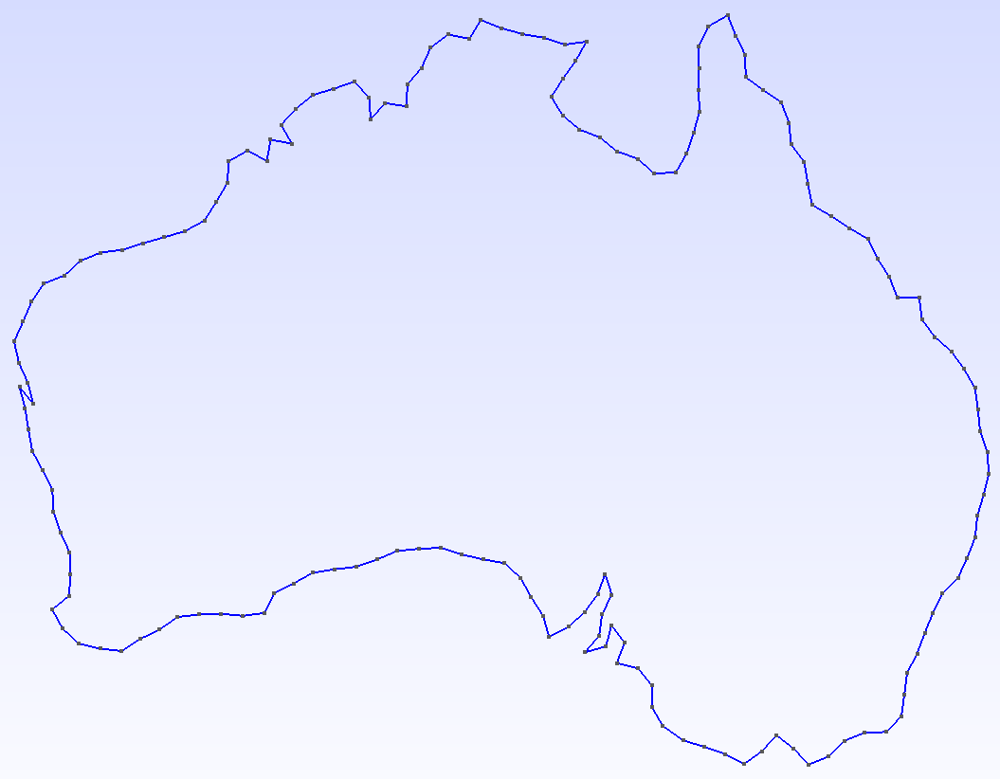
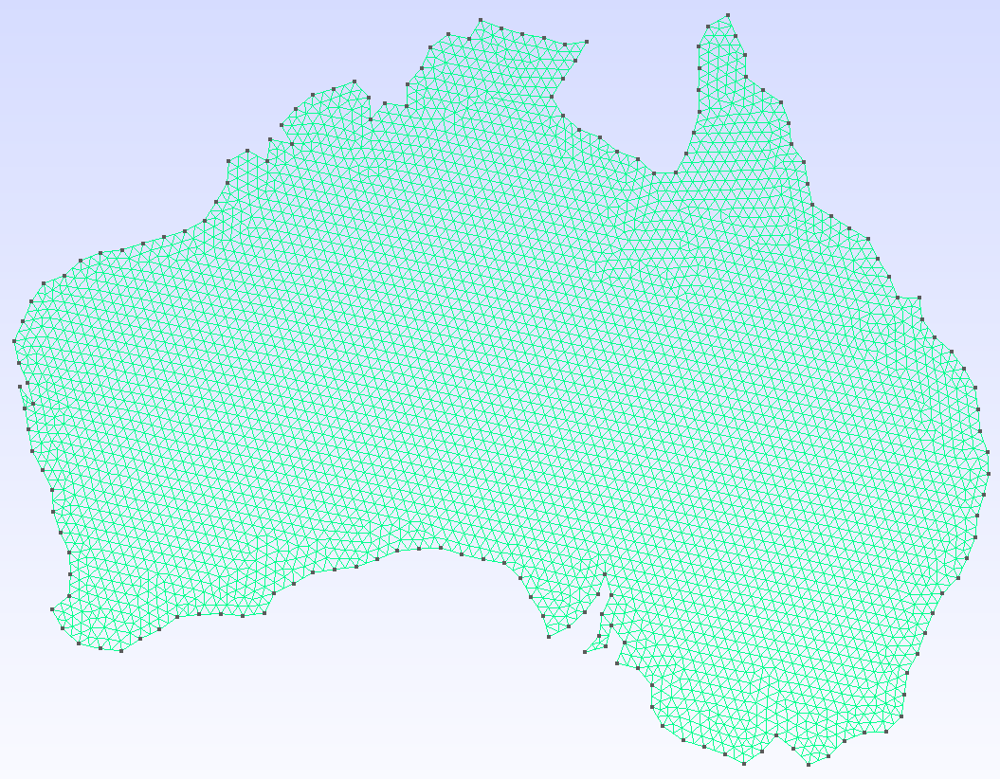
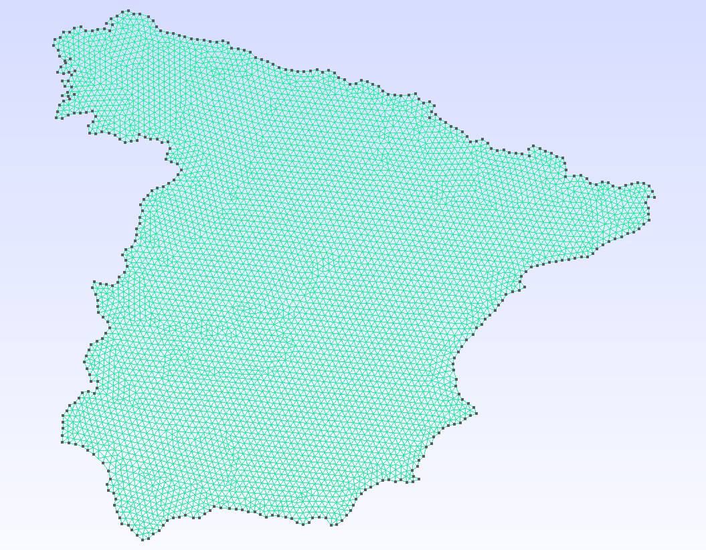
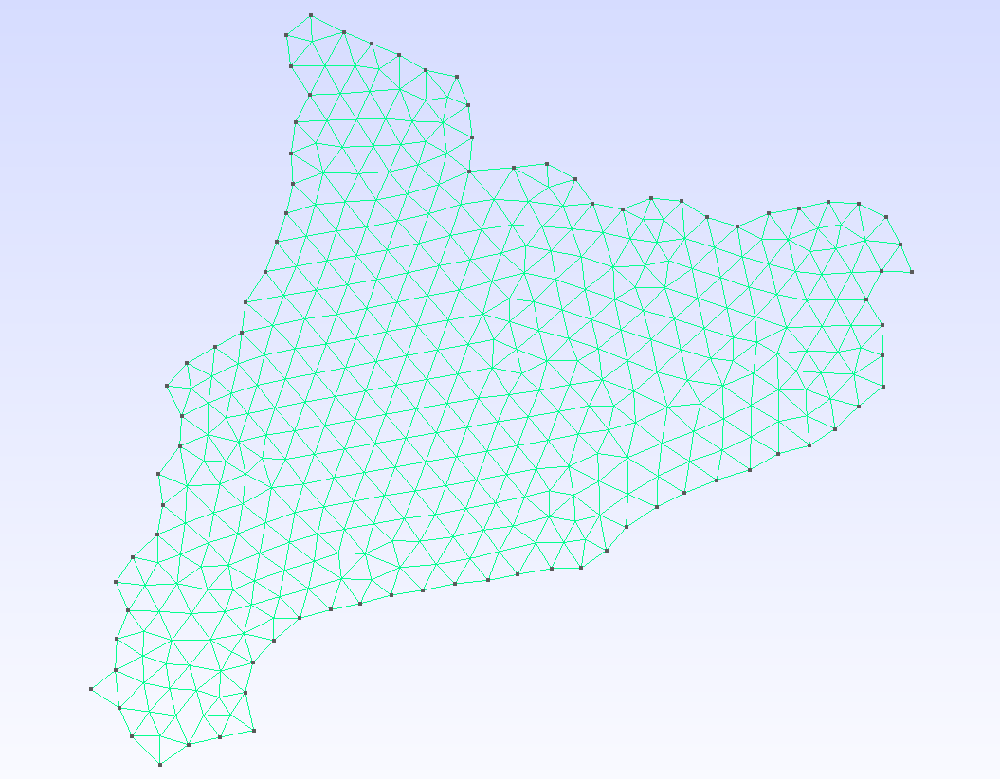

# ShapefileToGmsh.jl

```@docs
ShapefileToGmsh
```

A Julia package that converts ESRI Shapefiles into Gmsh geometry (`.geo`) and
mesh (`.msh`) files, with full control over coordinate projection, edge
resolution, and component selection.

---

| | |
|:---:|:---:|
|  |  |
| **Australia — geometry** | **Australia — mesh** |
|  |  |
| **Spain** | **Catalonia** |

---

## Features

- **Read & filter** — load Shapefiles and inspect their attribute tables; filter records or individual rings by any DBF attribute, geometry size, or bounding box.
- **Reproject** — convert between coordinate systems via Proj.jl (e.g. geographic degrees → Web Mercator metres).
- **Resample edges** — coarsen over-resolved coastlines or refine coarse boundaries to a target edge length.
- **Rescale** — normalise geometry into a dimensionless bounding box so `mesh_size` stays consistent across datasets.
- **Output** — write a human-readable `.geo` script or call the Gmsh API to produce a `.msh` file directly; supports linear/quadratic elements and quad recombination.
- **Split components** — one file per polygon ring, with user-defined filenames via `name_fn`.

## Installation

```julia
using Pkg
Pkg.add(url = "https://github.com/JordiManyer/ShapefileToGmsh.jl")
```

## Quick start

### Inspect a shapefile

```julia
using ShapefileToGmsh

list_components("NUTS_RG_01M_2024_3035.shp")
```

```
── Records (1798) ──────────────────────────────────
idx   NUTS_ID  LEVL_CODE  CNTR_CODE  NAME_LATN   rings
──────────────────────────────────────────────────────
1     AL011    3          AL         Dibër        1
2     AL012    3          AL         Durrës       1
...
1490  ES51     2          ES         Cataluña     1
...
1756  ES       0          ES         España       6
...

── Rings (1802) ────────────────────────────────────
idx   ring  NUTS_ID  ...  n_pts  area    xmin  xmax  ymin  ymax
───────────────────────────────────────────────────────────────
...
```

### Generate a mesh

```julia
shapefile_to_msh(
  "NUTS_RG_01M_2024_3035.shp",
  "output/nuts";
  select            = row -> row.NUTS_ID ∈ ("ES", "ES51") && row.ring == 1,
  name_fn           = row -> string(row.NUTS_ID),
  proj_method       = nothing,          # already in metres (EPSG:3035)
  edge_length_range = (10_000.0, Inf),  # coarsen to ≥ 10 km edges
  bbox_size         = 100.0,
  mesh_size         = 2.0,
  split_components  = true,
)
# → output/nuts/ES.msh, output/nuts/ES51.msh
```

## Pipeline overview

| Step | Function | Purpose |
|------|----------|---------|
| Read | [`read_shapefile`](@ref) | Parse `.shp` geometry, filter by record or ring |
| Reproject | [`project_to_meters`](@ref) | Convert coordinates via PROJ |
| Coarsen | [`coarsen_edges`](@ref) | Remove points on short edges |
| Refine | [`refine_edges`](@ref) | Subdivide long edges |
| Filter | [`filter_components`](@ref) | Drop degenerate rings after coarsening |
| Rescale | [`rescale`](@ref) | Normalise into an L × L bounding box |
| Output | [`write_geo`](@ref) / [`generate_mesh`](@ref) | Write `.geo` or `.msh` |

Each step is also available as a standalone function for more control.
See the [Pipeline guide](@ref pipeline) and [API reference](@ref api) for details.
